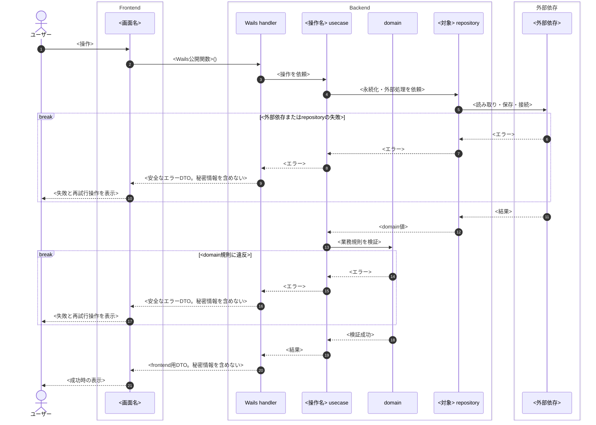

# Mermaid シーケンス図

Markdown の Mermaid 図で、操作の起点、責務境界、ユースケースの具体的な判断を分けて示す。

## 作成手順

1. ユーザー操作、画面状態、Wails公開関数、成功・失敗時の結果を整理する。
2. 参加者を左から右へ、次の順で置く。
   - `actor User as ユーザー`
   - `box Frontend` の中に画面
   - `box Backend` の中に Wails handler、usecase、domain、repository
   - `box 外部依存` の中に設定ファイル、OS資格情報ストア、DBなど
3. メッセージは呼び出し側の責務が分かる動詞で書く。Wails handlerはfrontend契約、usecaseは操作の組み立て、domainは規則、repositoryは永続化・外部接続を担当する。
4. domainを使わない読み取り操作では、domain参加者を残し、`Note over Domain: この読み取り操作では呼び出さない` と明記する。
5. repositoryまたはdomainで失敗し、そのWails呼び出しを終了する経路は `break` で記載する。handlerから画面へ安全なエラーDTOを返し、以降の正常経路へ進まないことを示す。
6. 正常経路は可能な限り一直線に記載する。画面の一覧／空状態など、backendの処理が同じ結果を返す表示分岐は、シーケンス図で分けず画面仕様またはフローチャートで扱う。
7. `alt` / `else` は、同じ呼び出しを継続する必要がある排他的な業務経路だけに使う。`alt` のネストは原則として行わない。
8. 完全な接続文字列、パスワード、資格情報の値をメッセージ・戻り値・注記へ書かない。

## Markdownの構成

- backend設計の成果物は `.local/<issue>/mmd/` に、関数ごと・連番付きで保存する。画面用HTMLへ重複出力しない。
- 一枚の巨大な図へ押し込まず、最初に「答える問い」を一文で置き、問いごとに図を分ける。
- 各ユースケースでは、原則として次の順に構成する。
  1. usecase起点の全体フローチャート（段階と早期終了）
  2. 判断が複雑な論点ごとの補助フローチャートと決定表
  3. 正常系を責務境界ごとに追うシーケンス図。外部依存や経路が異なる場合はシナリオ別に分ける
  4. エラーコード・画面への返却を対応付ける表
  5. 事前条件、成功・失敗時の事後条件、不変条件
- 状態遷移が設計判断の対象になる場合だけ、ライフサイクル図を追加する。未承認の項目は図の見出しと本文で明示する。
- 同じ情報を複数の図へ重複させない。全体フローは段階、補助図は判断、シーケンス図は責務境界を説明する。

## 固定書式

- Mermaidコードは Markdown の `mermaid` コードフェンスに入れる。
- `sequenceDiagram` の直後に `autonumber` を置く。
- 任意の配色指定、`themeVariables`、`themeCSS` を加えない。
- handler、usecase、domain、repositoryを省略・統合しない。実行されない層は注記で示す。
- handlerから画面へ返す値は、frontend用DTOであることと、秘密情報を含めないことを示す。

## テンプレート

